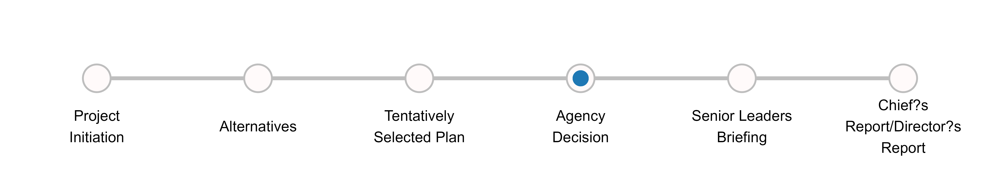

```{css, echo=FALSE}
h2, h3 {
  text-align: center;
}

body{ /* Normal  */
      font-size: 16px;
  }

th {    vertical-align: top;    
    white-space: nowrap;
    padding: 10px;
    
}
td {    vertical-align: top;
  padding: 10px;
}


@media print {
body {-webkit-print-color-adjust: exact;}
  .font-size{ 10pt;
  }
  .item-box {
    page-break-inside: avoid;
  }
  .section-box {
    page-break-inside: avoid;
  }

  .page-break {
  page-break-after: always;
  }

}

```

```{r echo=FALSE, message=FALSE, warning=FALSE, include=FALSE}
library(readr) 
library(magrittr) 
library(dplyr) 
library(kableExtra) 
library(rlang)
library(plotly)
library(ggplot2)
library(ggrepel)
library(dplyr)
library(knitr)
library(crosstalk)
library(tidyverse)
library(english)
library(DT)
library(webshot)
library(erarr)
library(usethis)
options(scipen = 999)
erisk_item<-erarr::erisk_item
risk_item_db<-data.frame(erisk_item)
erisk_project <- erarr::erisk_project
risk_project_db<-data.frame(erisk_project)
risk_transact <- erarr::risk_transact
risk_transact <- data.frame(risk_transact)
milestonedf<- erarr::milestonedf
milestone_df<-data.frame(erarr::milestonedf)
checkimagepath<-"../www/check.png"
headers<-c("Cost Impact", "Schedule Impact","Performance Impact")


erisk_ItemProj<-left_join(risk_item_db, risk_project_db, by =c("PROJECT_ID"), relationship = "many-to-many") 

erisk_ItemProj<-erisk_ItemProj |>
  mutate(RISK_NAME_ID = paste(RISK_IDENTIFIER,RISK_NAME))                 

risk_item_filt<- risk_item_db |>
  mutate(RISK_NAME_ID = paste(RISK_IDENTIFIER,RISK_NAME))|>
  select(RISK_ID, PROJECT_ID,RISK_NAME, RISK_NAME_ID , PROJECT_NAME, P2_NUMBER)


RiskImpactTable<-erisk_ItemProj |>
  select("RISK_ID","RISK_NAME_ID","RISK_NAME","RISK_IDENTIFIER","P2_NUMBER.x", "PROJECT_ID",
         "PROJECT_NAME.x", "RISK_NAME","RISKCATEGORY", 
         "DISCIPLINE", 
         "RISK_STATEMENT","LIKELIHOOD_DESC", "PROB_OCCURRENCE_EVIDENCE",  
         "COST_IMPACT_LOWEST", "COST_IMPACT_MOSTLIKELY", "COST_IMPACT_HIGHEST",
         "COST_IMPACT_EVIDENCE","SCHEDULE_IMPACT_LOWEST", 
         "SCHEDULE_IMPACT_MOSTLIKELY", "SCHEDULE_IMPACT_HIGHEST", 
         "SCHEDULE_IMPACT_EVIDENCE", "LIFECYCLEPHASENAME.x", 
         "PERFORMANCEIMPACT_DESC", "PERFORMANCEIMPACT","PERFORMANCE_IMPACT_DESC" 
         ,"PROJECTPHASEID", 
         "MILESTONE", "RISK_MANAGER", "COST_IMPACT_DISTTYPE", 
         "SCHEDULE_IMPACT_DISTTYPE", "NO_PERFORMANCE_IMPACT", "NO_COST_IMPACT",
         "NO_SCHEDULE_IMPACT")

risk_transact<-left_join(risk_transact, risk_item_filt, by=c("PROJECT_ID", 
                                                             "RISK_ID",
                                                             "PROJECT_NAME"), relationship = "many-to-many")     
risk_treat<-left_join(risk_treat, risk_item_filt, by=c("PROJECT_ID", "RISK_ID",
                                                       "PROJECT_NAME"), relationship = "many-to-many")


```

```{r echo=FALSE, eval = params$projID != ""}
risk_item<-filter(RiskImpactTable, RiskImpactTable$RISK_NAME_ID == params$riskID,
                  RiskImpactTable$PROJECT_NAME.x == params$projID)
risk_treatment<-filter(risk_treat, risk_treat$PROJECT_NAME == params$projID, 
                       risk_treat$RISK_NAME_ID == params$riskID)

```

```{r echo=FALSE, eval = params$p2ID != ""}
risk_item<-filter(RiskImpactTable, RiskImpactTable$RISK_NAME_ID == params$riskID, 
                  RiskImpactTable$P2_NUMBER.x == params$p2ID)
risk_treatment<-filter(risk_treat, risk_treat$PROJECT_NAME == params$projID, 
                       risk_treat$RISK_NAME_ID == params$riskID)

```


```{r echo=FALSE, message=FALSE, warning=FALSE}
risk_treat_table<-risk_treatment |>
  select(RISK_TREATMENT_ID,PROPOSED_RISK_TREATMENT,COST_IMPACT_RISK_TREATMENT,
         SCHEDULE_IMPACT_RISK_TREATMENT, IMPLEMENTED, RISK_NAME) |>
  mutate(IMPLEMENT_IMG = case_when(
    IMPLEMENTED == 1 ~ checkimagepath,
    IMPLEMENTED == 0 ~ " ")) |>
  select(RISK_TREATMENT_ID,PROPOSED_RISK_TREATMENT,COST_IMPACT_RISK_TREATMENT,
         SCHEDULE_IMPACT_RISK_TREATMENT, IMPLEMENT_IMG) |>
  mutate(PROPOSED_RISK_TREATMENT = paste0(( "Measure "), 
                                          str_to_title(english::english(
                                            RISK_TREATMENT_ID)),": ",
                                          PROPOSED_RISK_TREATMENT )) |>
  mutate(SCHEDULE_IMPACT_RISK_TREATMENT = 
           paste(SCHEDULE_IMPACT_RISK_TREATMENT, "Days"))

treat_condit <- ifelse(nrow(risk_treat_table)>0,TRUE,FALSE)


```

###### Report Created On: `r format(Sys.time(), '%d %B, %Y')`
```{r echo=FALSE, warning=FALSE, message=FALSE, results='asis'}

header<-paste("Project:",risk_item$PROJECT_NAME.x," ",(risk_item$RISK_IDENTIFIER))


cat("###",header)
```

#### Risk Phase:`r risk_item$LIFECYCLEPHASENAME`, Category:`r risk_item$RISKCATEGORY`

#### Risk Summary: `r risk_item$RISK_NAME`

<center>
```{r milestoneplot, fig.height=2, fig.width=8, echo=FALSE, message=FALSE}
mileplot<-erarr::milestoneplot(riskitem=risk_item, milestonedf = milestone_df)



```
</center>

##### **Lead Discipline:** `r risk_item$DISCIPLINE`

##### `r risk_item$RISK_STATEMENT`

<center>

```{r echo=F, out.width="75%", fig.height=2}
monteframe <- data.frame(Opportunity = c(100), Low = c(100))
plot_ly() |>
  add_pie(
    monteframe$Opportunity,
    value = monteframe$Opportunity,
    title = "Opportunity",
    textinfo = 'none',
    name = " ",
    domain = list(row = 0, column = 0),
    hole = 0.7,
    marker = list(colors = "#1F78B4")
  ) |>
  add_pie(
    monteframe$Opportunity,
    value = monteframe$Opportunity,
    title = "Opportunity",
    textinfo = 'none',
    name = " ",
    domain = list(row = 0, column = 1),
    hole = 0.7,
    marker = list(colors = "#1F78B4")
  ) |>
  add_pie(
    monteframe$Low,
    value = monteframe$Low,
    title = "Low",
    textinfo = 'none',
    name = " ",
    domain = list(row = 0, column = 2),
    hole = 0.7,
    marker = list(colors = "#33A02C")
  ) |>
  layout(
    title = "",
    showlegend = F,
    grid = list(rows = 1, columns = 3),
    annotations = list(
      x = c(0.125, 0.49, 0.9, 0.12, 0.485),
      y = c(1.2, 1.2, 1.2, -0.15,-0.15),
      text = c("Cost", "Schedule", "Performance", "Mean: $0",
               "Mean: 0 Days"),
      xref = "paper",
      yref = "paper",
      showarrow = F
    )
  )


```

</center>

#### **Event Likelihood:** `r risk_item$LIKELIHOOD_DISC`
#### `r risk_item$PROB_OCCURRENCE_EVIDENCE`

```{r echo=FALSE, results='asis'}
risk_item_table <- risk_item |>
  select(
    NO_COST_IMPACT,
    NO_SCHEDULE_IMPACT,
    NO_PERFORMANCE_IMPACT,
    COST_IMPACT_MOSTLIKELY,
    SCHEDULE_IMPACT_MOSTLIKELY,
    COST_IMPACT_LOWEST,
    COST_IMPACT_HIGHEST,
    COST_IMPACT_EVIDENCE,
    SCHEDULE_IMPACT_LOWEST,
    SCHEDULE_IMPACT_HIGHEST,
    SCHEDULE_IMPACT_EVIDENCE,
    PERFORMANCE_IMPACT_DESC,
    PERFORMANCEIMPACT,
    PERFORMANCEIMPACT_DESC,
    SCHEDULE_IMPACT_DISTTYPE,
    COST_IMPACT_DISTTYPE
  ) |>
  mutate(
    COST_IMPACT_LOWEST = paste0("<p style = 
                                'font-family: Arial Narrow;font-size:10pt'>",
                                "Lowest","</p>", 
                                formattable::currency(COST_IMPACT_LOWEST)),
    COST_IMPACT_HIGHEST = paste0("<p style = 
                                'font-family: Arial Narrow;font-size:10pt'>",
                                "Highest","</p>",
                                 formattable::currency(COST_IMPACT_HIGHEST)),
    COST_IMPACT_MOSTLIKELY = paste0("<p style = 
                                    'font-family: Arial Narrow;font-size:10pt'>",
                                    "Most Likely","</p>", 
                                    formattable::currency(COST_IMPACT_MOSTLIKELY)),
    SCHEDULE_IMPACT_HIGHEST = paste0("<p style = 
                                     'font-family: Arial Narrow;font-size:10pt'>",
                                     "Highest","</p>",
                                     SCHEDULE_IMPACT_HIGHEST, " days"),
    SCHEDULE_IMPACT_LOWEST = paste0("<p style = 
                                    'font-family: Arial Narrow;font-size:10pt'>",
                                    "Lowest","</p>",
                                    SCHEDULE_IMPACT_LOWEST, " days"),
    SCHEDULE_IMPACT_MOSTLIKELY = paste0("<p style = 
                                        'font-family: Arial Narrow;font-size:10pt'>",
                                        "Most Likely","</p>",
                                        SCHEDULE_IMPACT_MOSTLIKELY, " days"),
    PERFORMANCE_IMPACT_DESC = paste0("<p style = 
                                        'font-family: Arial;font-size:10pt; 
                                     font-weight: bold'>",
                                        "Performance Impact:","</p>",
                                        PERFORMANCE_IMPACT_DESC, " to ", 
                                     PERFORMANCEIMPACT),
    PERFORMANCEIMPACT = paste0("<p style = 
                                        'font-family: Arial;font-size:10pt;
                               font-weight: bold'>",
                                        "Performance Impact Type:","</p>",
                                        PERFORMANCEIMPACT)
  )

####Modularize assess for each cost schedule and performance build function

costcolumn <-
  if (risk_item_table$NO_COST_IMPACT == 1) {
    c("No cost impact is anticipated","","","")
  } else if (risk_item_table$COST_IMPACT_DISTTYPE == 299) {
    c(risk_item_table$COST_IMPACT_MOSTLIKELY,
      "",
      "",
      "")
  } else if (risk_item_table$COST_IMPACT_DISTTYPE == 306) {
    c(
      risk_item_table$COST_IMPACT_LOWEST,
      "",
      risk_item_table$COST_IMPACT_HIGHEST,
      risk_item_table$COST_IMPACT_EVIDENCE
    )
  } else if (risk_item_table$COST_IMPACT_DISTTYPE == 302) {
    c(
      risk_item_table$COST_IMPACT_LOWEST,
      risk_item_table$COST_IMPACT_MOSTLIKELY,
      risk_item_table$COST_IMPACT_HIGHEST,
      risk_item_table$COST_IMPACT_EVIDENCE
    )
  }

schedulecolumn <-
  if (risk_item_table$NO_PERFORMANCE_IMPACT == 1) {
    c("No schedule impact is anticipated","","","")
  } else if (risk_item_table$SCHEDULE_IMPACT_DISTTYPE == 299) {
    c(risk_item_table$SCHEDULE_IMPACT_MOSTLIKELY,
    "",
    "",
    "")
  } else if (risk_item_table$SCHEDULE_IMPACT_DISTTYPE == 306) {
    c(
      risk_item_table$SCHEDULE_IMPACT_LOWEST,
      "",
      risk_item_table$SCHEDULE_IMPACT_HIGHEST,
      risk_item_table$SCHEDULE_IMPACT_EVIDENCE
    )
  } else if (risk_item_table$SCHEDULE_IMPACT_DISTTYPE == 302) {
    c(
      risk_item_table$SCHEDULE_IMPACT_LOWEST,
      risk_item_table$SCHEDULE_IMPACT_MOSTLIKELY,
      risk_item_table$SCHEDULE_IMPACT_HIGHEST,
      risk_item_table$SCHEDULE_IMPACT_EVIDENCE
    )
  }

performancecolumn <-
  if (risk_item_table$NO_PERFORMANCE_IMPACT == 1) {
    c("No performance impact is anticipated","","","")
  } else {
    c(
      risk_item_table$PERFORMANCE_IMPACT_DESC,
      risk_item_table$PERFORMANCEIMPACT,
      risk_item_table$PERFORMANCEIMPACT_DESC,
      ""
    )
  }


disttable<-data.frame(costcolumn, schedulecolumn,performancecolumn)

kable(disttable,format = "html", escape=FALSE, col.names=c("Cost Impact",
                                                            "Schedule Impact",
                                                            "Performance Impact"))|>
  kable_styling()

# knitr::kables(
#   list(
#     knitr::kable(costcolumn,
#                  format = "html",
#                  col.names = "Cost Impact",escape=FALSE) |>
#        kable_styling(),
#     knitr::kable(schedulecolumn,
#                  format = "html",
#                  col.names = "Schedule Impact",escape=FALSE) |>
#        kable_styling(),
# 
#     knitr::kable(performancecolumn,
#                  format = "html",
#                  col.names = "Performance Impact",escape=FALSE) |>
#        kable_styling()
#   )
# )


```

#### Risk Treatments:

`r if(!treat_condit){"Risk treatments have not been completed for this risk item"}`

```{r echo = FALSE, message = FALSE, eval = treat_condit}
risk_treat_table$IMPLEMENT_IMG = sprintf("",
risk_treat_table$IMPLEMENT_IMG)


kbl(
risk_treat_table,
format = "html",
col.names = NULL,
align = "llccc"
) |>
kable_styling() |>
add_header_above(c(
"Measures" = 2,
"Impacts" = 2,
"Implemented" = 1
))


```

##### Risk Manager: `r risk_item$RISK_MANAGER`

