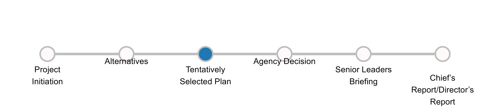

```{css, echo=FALSE}
h4 {
  font-weight: bold;
}


table {
width: 100%;
  border-bottom-style: none
}


th {vertical-align: top;    
    white-space: nowrap;
    padding: 5px;
    border-bottom: 1px solid #ddd;
}
td {    vertical-align: top;
  padding: 5px;
}


@media print {
body {-webkit-print-color-adjust: exact;}

  .item-box {
    page-break-inside: avoid;
  }
  .section-box {
    page-break-inside: avoid;
  }

  .page-break {
  page-break-after: always;
  }

}
```

```{r echo=FALSE, message=FALSE, warning=FALSE, include=FALSE}
library(readr) 
library(magrittr) 
library(dplyr) 
library(kableExtra) 
library(rlang)
library(plotly)
library(dplyr)
library(knitr)
library(tidyverse)
library(english)
library(DT)
library(erarr)
library(usethis)
options(scipen = 999)
erisk_item <-utils::read.csv("../data/RISKLIST_FULL_0320245.csv")
risk_item_db<-data.frame(erisk_item)
erisk_project <- utils::read.csv("../data/PROJECTLIST_FULL_03226024.csv")
risk_project_db<-data.frame(erisk_project)
risk_transact <- erarr::risk_transact
risk_transact <- data.frame(risk_transact)
milestonedf<- utils::read.csv("../data/PHASEMILESTONE.csv")
milestone_df<-data.frame(milestonedf)
checkimagepath<-"../www/check.png"
headers<-c("Cost Impact", "Schedule Impact","Performance Impact")


erisk_ItemProj<-left_join(risk_item_db, risk_project_db, by =c("PROJECT_ID"), relationship = "many-to-many") 

erisk_ItemProj<-erisk_ItemProj |>
  mutate(RISK_NAME_ID = paste(RISK_IDENTIFIER,RISK_NAME))                 

risk_item_filt<- risk_item_db |>
  mutate(RISK_NAME_ID = paste(RISK_IDENTIFIER,RISK_NAME))|>
  select(RISK_ID, PROJECT_ID,RISK_NAME, RISK_NAME_ID , PROJECT_NAME, P2_NUMBER)


RiskImpactTable<-erisk_ItemProj |>
  select("RISK_ID","RISK_NAME_ID","RISK_NAME","RISK_IDENTIFIER","P2_NUMBER.x", "PROJECT_ID",
         "PROJECT_NAME.x", "RISK_NAME","RISKCATEGORY", 
         "DISCIPLINE", 
         "RISK_STATEMENT","LIKELIHOOD_DESC", "PROB_OCCURRENCE_EVIDENCE",  
         "COST_IMPACT_LOWEST", "COST_IMPACT_MOSTLIKELY", "COST_IMPACT_HIGHEST",
         "COST_IMPACT_EVIDENCE","SCHEDULE_IMPACT_LOWEST", 
         "SCHEDULE_IMPACT_MOSTLIKELY", "SCHEDULE_IMPACT_HIGHEST", 
         "SCHEDULE_IMPACT_EVIDENCE", "LIFECYCLEPHASENAME.x", 
         "PERFORMANCEIMPACT_DESC", "PERFORMANCEIMPACT","PERFORMANCE_IMPACT_DESC" 
         ,"PROJECTPHASEID", 
         "MILESTONE", "RISK_MANAGER", "COST_IMPACT_DISTTYPE", 
         "SCHEDULE_IMPACT_DISTTYPE", "NO_PERFORMANCE_IMPACT", "NO_COST_IMPACT",
         "NO_SCHEDULE_IMPACT")

risk_transact<-left_join(risk_transact, risk_item_filt, by=c("PROJECT_ID", 
                                                             "RISK_ID",
                                                             "PROJECT_NAME"), relationship = "many-to-many")     
risk_treat<-left_join(risk_treat, risk_item_filt, by=c("PROJECT_ID", "RISK_ID",
                                                       "PROJECT_NAME"), relationship = "many-to-many")


```


```{r echo=FALSE, eval = params$projID != ""}
risk_item<-filter(RiskImpactTable, RiskImpactTable$RISK_NAME_ID == params$riskID,
                  RiskImpactTable$PROJECT_NAME.x == params$projID)
risk_treatment<-filter(risk_treat, risk_treat$PROJECT_NAME == params$projID, 
                       risk_treat$RISK_NAME_ID == params$riskID)

```

```{r echo=FALSE, eval = params$p2ID != ""}
risk_item<-filter(RiskImpactTable, RiskImpactTable$RISK_NAME_ID == params$riskID, 
                  RiskImpactTable$P2_NUMBER.x == params$p2ID)
risk_treatment<-filter(risk_treat, risk_treat$PROJECT_NAME == params$projID, 
                       risk_treat$RISK_NAME_ID == params$riskID)

```


```{r echo=FALSE, message=FALSE, warning=FALSE}
risk_treat_table<-risk_treatment |>
  select(RISK_TREATMENT_ID,PROPOSED_RISK_TREATMENT,COST_IMPACT_RISK_TREATMENT,
         SCHEDULE_IMPACT_RISK_TREATMENT, IMPLEMENTED, RISK_NAME) |>
  mutate(IMPLEMENT_IMG = case_when(
    IMPLEMENTED == 1 ~ checkimagepath,
    IMPLEMENTED == 0 ~ " ")) |>
  select(RISK_TREATMENT_ID,PROPOSED_RISK_TREATMENT,COST_IMPACT_RISK_TREATMENT,
         SCHEDULE_IMPACT_RISK_TREATMENT, IMPLEMENT_IMG) |>
  mutate(PROPOSED_RISK_TREATMENT = paste0(( "Measure "), 
                                          str_to_title(english::english(
                                            RISK_TREATMENT_ID)),": ",
                                          PROPOSED_RISK_TREATMENT )) |>
  mutate(COST_IMPACT_RISK_TREATMENT = as.character(COST_IMPACT_RISK_TREATMENT))|>
  mutate(COST_IMPACT_RISK_TREATMENT = paste0("$",formattable::currency(COST_IMPACT_RISK_TREATMENT)))|>
  mutate(SCHEDULE_IMPACT_RISK_TREATMENT = 
           paste(SCHEDULE_IMPACT_RISK_TREATMENT, "Days"))

treat_condit <- ifelse(nrow(risk_treat_table)>0,TRUE,FALSE)
transact_condit <- ifelse(nrow(risk_transact)>0,TRUE,FALSE)

```

###### Report Created On: `r format(Sys.time(), '%d %B, %Y')`
```{r echo=FALSE, warning=FALSE, message=FALSE, results='asis'}

header<-paste("Project:",risk_item$PROJECT_NAME.x," ",(risk_item$RISK_IDENTIFIER))


cat("####",header)
```

##### Risk Phase:`r risk_item$LIFECYCLEPHASENAME`, Category:`r risk_item$RISKCATEGORY`

##### Risk Summary: `r risk_item$RISK_NAME`

<center>
```{r milestoneplot, fig.height=1.20, fig.width=8, echo=FALSE, message=FALSE}
mileplot<-erarr::milestoneplot(riskitem=risk_item, milestonedf = milestone_df)



```
</center>

###### **Lead Discipline:** `r risk_item$DISCIPLINE`

`r risk_item$RISK_STATEMENT` 
<center>
```{r proj montepies, message=FALSE, warning=FALSE, echo=FALSE,fig.height=1.5, fig.width=6}
monteframe <- data.frame(Opportunity = c(100), Low = c(100))
monte_pie<-plot_ly() |>
  add_pie(
    monteframe$Opportunity,
    value = monteframe$Opportunity,
    title = "Opportunity",
    textinfo = 'none',
    name = " ",
    domain = list(row = 0, column = 0),
    hole = 0.7,
    marker = list(colors = "#1F78B4")
  ) |>
  add_pie(
    monteframe$Opportunity,
    value = monteframe$Opportunity,
    title = "Opportunity",
    textinfo = 'none',
    name = " ",
    domain = list(row = 0, column = 1),
    hole = 0.7,
    marker = list(colors = "#1F78B4")
  ) |>
  add_pie(
    monteframe$Low,
    value = monteframe$Low,
    title = "Low",
    textinfo = 'none',
    name = " ",
    domain = list(row = 0, column = 2),
    hole = 0.7,
    marker = list(colors = "#33A02C")
  )

  pies<-monte_pie |>
    plotly::layout(title = "",
                    showlegend = F,
      margin=list(l=20,r=20,b=20, t=25, pad=0),
                   grid=list(rows=1, columns=3),
           showlegend=F,
           annotations = list(
      x = c(0.125, 0.49, 0.9, 0.12, 0.485),
      y = c(1.2, 1.2, 1.2, -0.15,-0.15),
      xref = "paper",
      yref = "paper",
      showarrow = F,
      text = c("Cost", "Schedule", "Performance", "Mean: $0",
               "Mean: 0 Days")))
  pies
```
</center>
###### **Event Likelihood:** `r risk_item$LIKELIHOOD_DESC`
`r risk_item$PROB_OCCURRENCE_EVIDENCE`

```{r echo=FALSE, results='asis'}
risk_item_table <- risk_item |>
  select(
    NO_COST_IMPACT,
    NO_SCHEDULE_IMPACT,
    NO_PERFORMANCE_IMPACT,
    COST_IMPACT_MOSTLIKELY,
    SCHEDULE_IMPACT_MOSTLIKELY,
    COST_IMPACT_LOWEST,
    COST_IMPACT_HIGHEST,
    COST_IMPACT_EVIDENCE,
    SCHEDULE_IMPACT_LOWEST,
    SCHEDULE_IMPACT_HIGHEST,
    SCHEDULE_IMPACT_EVIDENCE,
    PERFORMANCE_IMPACT_DESC,
    PERFORMANCEIMPACT,
    PERFORMANCEIMPACT_DESC,
    SCHEDULE_IMPACT_DISTTYPE,
    COST_IMPACT_DISTTYPE
  ) |>
  mutate(
    COST_IMPACT_LOWEST = paste0("<p style = 
                                'font-family: Arial Narrow;font-size:8pt'>",
                                "Lowest","</p>", 
                                formattable::currency(COST_IMPACT_LOWEST)),
    COST_IMPACT_HIGHEST = paste0("<p style = 
                                'font-family: Arial Narrow;font-size:8pt'>",
                                "Highest","</p>",
                                 formattable::currency(COST_IMPACT_HIGHEST)),
    COST_IMPACT_MOSTLIKELY = paste0("<p style = 
                                    'font-family: Arial Narrow;font-size:8pt'>",
                                    "Most Likely","</p>", 
                                    formattable::currency(COST_IMPACT_MOSTLIKELY)),
    SCHEDULE_IMPACT_HIGHEST = paste0("<p style = 
                                     'font-family: Arial Narrow;font-size:8pt'>",
                                     "Highest","</p>",
                                     SCHEDULE_IMPACT_HIGHEST, " days"),
    SCHEDULE_IMPACT_LOWEST = paste0("<p style = 
                                    'font-family: Arial Narrow;font-size:8pt'>",
                                    "Lowest","</p>",
                                    SCHEDULE_IMPACT_LOWEST, " days"),
    SCHEDULE_IMPACT_MOSTLIKELY = paste0("<p style = 
                                        'font-family: Arial Narrow;font-size:8pt'>",
                                        "Most Likely","</p>",
                                        SCHEDULE_IMPACT_MOSTLIKELY, " days"),
    PERFORMANCE_IMPACT_DESC = paste0("<p style = 
                                        'font-family: Arial;font-size:8pt; 
                                     font-weight: bold'>",
                                        "Performance Impact:","</p>",
                                        PERFORMANCE_IMPACT_DESC, " to ", 
                                     PERFORMANCEIMPACT),
    PERFORMANCEIMPACT = paste0("<p style = 
                                        'font-family: Arial;font-size:8pt;
                               font-weight: bold'>",
                                        "Performance Impact Type:","</p>",
                                        PERFORMANCEIMPACT)
  )

####Modularize assess for each cost schedule and performance build function

costcolumn <-
  if (risk_item_table$NO_COST_IMPACT == 1) {
    c("No cost impact is anticipated","","","")
  } else if (risk_item_table$COST_IMPACT_DISTTYPE == 299) {
    c(risk_item_table$COST_IMPACT_MOSTLIKELY,
      "",
      "",
      "")
  } else if (risk_item_table$COST_IMPACT_DISTTYPE == 306) {
    c(
      risk_item_table$COST_IMPACT_LOWEST,
      "",
      risk_item_table$COST_IMPACT_HIGHEST,
      risk_item_table$COST_IMPACT_EVIDENCE
    )
  } else if (risk_item_table$COST_IMPACT_DISTTYPE == 302) {
    c(
      risk_item_table$COST_IMPACT_LOWEST,
      risk_item_table$COST_IMPACT_MOSTLIKELY,
      risk_item_table$COST_IMPACT_HIGHEST,
      risk_item_table$COST_IMPACT_EVIDENCE
    )
  }

schedulecolumn <-
  if (risk_item_table$NO_PERFORMANCE_IMPACT == 1) {
    c("No schedule impact is anticipated","","","")
  } else if (risk_item_table$SCHEDULE_IMPACT_DISTTYPE == 299) {
    c(risk_item_table$SCHEDULE_IMPACT_MOSTLIKELY,
    "",
    "",
    "")
  } else if (risk_item_table$SCHEDULE_IMPACT_DISTTYPE == 306) {
    c(
      risk_item_table$SCHEDULE_IMPACT_LOWEST,
      "",
      risk_item_table$SCHEDULE_IMPACT_HIGHEST,
      risk_item_table$SCHEDULE_IMPACT_EVIDENCE
    )
  } else if (risk_item_table$SCHEDULE_IMPACT_DISTTYPE == 302) {
    c(
      risk_item_table$SCHEDULE_IMPACT_LOWEST,
      risk_item_table$SCHEDULE_IMPACT_MOSTLIKELY,
      risk_item_table$SCHEDULE_IMPACT_HIGHEST,
      risk_item_table$SCHEDULE_IMPACT_EVIDENCE
    )
  }

performancecolumn <-
  if (risk_item_table$NO_PERFORMANCE_IMPACT == 1) {
    c("No performance impact is anticipated","","","")
  } else {
    c(
      risk_item_table$PERFORMANCE_IMPACT_DESC,
      risk_item_table$PERFORMANCEIMPACT,
      risk_item_table$PERFORMANCEIMPACT_DESC,
      ""
    )
  }


disttable<-data.frame(costcolumn, schedulecolumn,performancecolumn)

kable(disttable,format = "html", escape=FALSE, col.names=c("Cost Impact",
                                                            "Schedule Impact",
                                                            "Performance Impact"))

```
`r if(!treat_condit){"Risk treatments have not been completed for this risk item"}`

```{r echo = FALSE, message = FALSE, eval = treat_condit}
risk_treat_table$IMPLEMENT_IMG = sprintf("",
risk_treat_table$IMPLEMENT_IMG)

kbl(
risk_treat_table,
format = "html",
col.names = NULL,
align = "llccc"
) |>
kable_styling() |>
add_header_above(c(
"Measures" = 2,
"Impacts" = 2,
"Implemented" = 1
))


```

##### Risk Manager: `r risk_item$RISK_MANAGER`

##### Risk Log


`r if(!transact_condit){"Risk transactions have not been completed for this risk item"}`


```{r risk log, echo = FALSE, warning=FALSE, eval= FALSE}
risk_log<-data.frame(risk_transact)
risk_log<-risk_log %>%
  mutate('costcolor' = case_when(COST_RISK_RANKING == 0 ~ '#1F78B4',
  COST_RISK_RANKING == 1 ~'#33A02C', 
  COST_RISK_RANKING == 2 ~'#FF7F00',
  COST_RISK_RANKING ==  3 ~ '#E31A1C')) %>%
  mutate('schedulecolor' = case_when(SCHEDULE_RISK_RANKING == 0 ~ '#1F78B4',
  SCHEDULE_RISK_RANKING == 1 ~'#33A02C', 
  SCHEDULE_RISK_RANKING == 2 ~'#FF7F00',
  SCHEDULE_RISK_RANKING ==  3 ~ '#E31A1C')) %>%
  mutate('performancecolor' = case_when(PERFORMANCEIMPACT_RISK_RANKING == 0 ~ '#1F78B4',
  PERFORMANCEIMPACT_RISK_RANKING ==1 ~'#33A02C', 
  PERFORMANCEIMPACT_RISK_RANKING == 2 ~'#FF7F00',
  PERFORMANCEIMPACT_RISK_RANKING ==  3 ~ '#E31A1C'))%>%
  mutate(TREAT_IMPLEMENT_IMG = if_else(is.na(TREATMENTS_IMPLEMENTED), "", checkimagepath))
         
         

risk_log_table<-risk_log |>
  select(DATE_TIME, REASON, RISK_LOG_NOTE, TREAT_IMPLEMENT_IMG, COST_RISK_RANKING, SCHEDULE_RISK_RANKING, PERFORMANCEIMPACT_RISK_RANKING, costcolor, schedulecolor, performancecolor )

risk_log_table$TREAT_IMPLEMENT_IMG = sprintf("", risk_log_table$TREAT_IMPLEMENT_IMG)
risk_log_table[1:10]|>
  mutate(
    COST_RISK_RANKING = cell_spec(COST_RISK_RANKING, "html", color = costcolor, align = 'c', background = costcolor),
    SCHEDULE_RISK_RANKING = cell_spec(SCHEDULE_RISK_RANKING, "html", color = schedulecolor, align = 'c', background = schedulecolor),
      PERFORMANCEIMPACT_RISK_RANKING = cell_spec(PERFORMANCEIMPACT_RISK_RANKING, "html", color = performancecolor, align = 'c', background = performancecolor) ) |>
  select(DATE_TIME, REASON,RISK_LOG_NOTE, TREAT_IMPLEMENT_IMG, COST_RISK_RANKING, SCHEDULE_RISK_RANKING, PERFORMANCEIMPACT_RISK_RANKING) |>
  kbl(format = "html", escape = F, col.names =c("Edit Date", "Reason for Change", "Risk Log Note",  "Measures Implemented", "Cost","Schedule","Performance"), align="lllcccc")|>
  kable_styling(bootstrap_options = c("striped", "hover", "condensed", "responsive"))

                                                    
```
